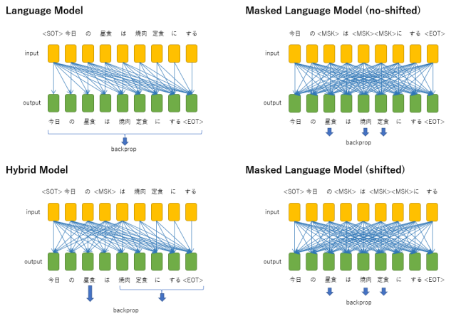

# GPTSAN


汎用大規模日本語Switch Transformerモデル





# GPTSANとは

なんにでも使える汎用日本語言語モデルを目指して作成した、Swich Transformerモデルの学習＆文章生成のコードです。

テキストエンコードは独自のByte-Pairモデルを使用します。Swich Transformerなのでパラメーター数を容易にスケールできます。

# 学習


## モデルの種類

GPTSANでは、異なる4種類の事前学習をサポートします（[こちら](report/model-type.png)の図を参照）。

Language ModelはGPTと同じで、Transformerは情報を後ろのみへと伝播させるDecoderモデルに、一つ前にずれたトークン列を学習させます。

Masked Language ModelはBERTと同じで、Encoderモデルに文章の一部分をマスクした入力を与え、マスク部分のトークンのみを学習させます。

Hybrid Modelは、[T5](https://arxiv.org/abs/1910.10683)の論文で「Prefix LM」と紹介されている、Transformerの前半がEncoder、後半がDecoderとなっているモデルに、マスクと言語モデルの両方を学習させます。Encoder部分の長さは可変で、事前学習の際にはランダムな長さをEncoderの入力とします。

[T5](https://arxiv.org/abs/1910.10683)の論文によると、ObjectiveをLanguage Modelとした時の最も良いモデルはPrefix LMであるとされているため、文章の続きを生成するタスクや、抽象型要約などにはHybrid Modelが望ましいと考えられます。Language Modelは文章生成、Masked Language Modelは抽出型要約などのタスクのベースモデルとして使用しますが、Hybrid Modelならばどちらのタスクにも利用できます。


## 学習データの作成

事前学習には、500GiBほどの日本語コーパスが必要になります。

ここでは、[C4](https://huggingface.co/datasets/allenai/c4)、[CC100](http://data.statmt.org/cc-100)、[NWC 2010](http://www.s-yata.jp/corpus/nwc2010/)を利用する方法を紹介します。

**C4のダウンロード**

・git-lfsをダウンロード

```sh
$ curl -s https://packagecloud.io/install/repositories/github/git-lfs/script.deb.sh | sudo bash
$ sudo apt-get install git-lfs
```

・huggingfaceのGitHubから日本語コーパスをClone

```sh
$ mkdir C4; cd C4
$ GIT_LFS_SKIP_SMUDGE=1 git clone https://huggingface.co/datasets/allenai/c4
$ cd c4
$ git lfs pull --include "multilingual/c4-ja-validation*.json.gz"
$ cd ../..
```

・展開

```sh
$ cd C4/c4/multilingual
$ python
>>> import json,uuid,gzip
>>> wf, wc = open('../../'+str(uuid.uuid4())+'.txt','w'), 0
>>> for i in range(8):
...     for l in gzip.open('c4-ja-validation.tfrecord-0000%d-of-00008.json.gz'%i).readlines():
...         wc += wf.write(json.loads(l)['text'].strip() + '\n\n')
...         if wc > 1000 * 1000 * 200:
...             wf.close()
...             wf, wc = open('../../'+str(uuid.uuid4())+'.txt','w'), 0
...
>>> wf.close()
^D
$ cd ../../..
$ rm -rf C4/c4/
```

**CC100のダウンロード**

・ダウンロード

```sh
$ mkdir CC100; cd CC100
$ wget http://data.statmt.org/cc-100/ja.txt.xz
```

・展開

```sh
$ unxz ja.txt.xz
$ python
>>> import uuid
>>> f = open("ja.txt")
>>> wf, wc = open(str(uuid.uuid4()),"w"), 0
>>> l = f.readline()
>>> while l:
...     if l == '\n' and wc > 1000 * 1000 * 200:
...         wf.close()
...         wc = 0
...         wf = open(str(uuid.uuid4()),"w")
...     else:
...         wc += wf.write(l)
...     l = f.readline()
...
>>> wf.close()
^D
$ rm ja.txt
$ cd ..
```

**NWC 2010のダウンロード**

[NWC 2010](http://www.s-yata.jp/corpus/nwc2010/)のホームページからコーパスの利用をリクエストしダウンロードURLを発行して貰ったら、すべてダウンロードして「corpus2010」というディレクトリに展開します。

**その他のコーパス**

その他のコーパス（Wikipedia全文コーパスなど）があれば、「extra_content」というディレクトリに配置します。

ファイル数が多くなりすぎないように、空行で文章の区切りとなるようにして、1つあたり数百MB程度のテキストファイルにまとめておきます。


## tfrecordファイルの作成

[NWC 2010](http://www.s-yata.jp/corpus/nwc2010/)のコーパスには文章の区切りがなく、\<endoftext\>を作成出来ません。そこで、\<SEP\>トークンを特殊トークン（句読点またはEOT）として扱います。学習時には[NWC 2010](http://www.s-yata.jp/corpus/nwc2010/)のコーパスのみ\<SEP\>トークン区切りとし、文章の生成時に\<SEP\>が出現したら、句読点かEOTのどちらか可能性の高い方を採用します。

また、\<bagoftoken\>という特殊トークンがあります。これは、同じトークンが連続して3つ以上出現したときは、対象トークン＋\<BAG\>とエンコードするためのものです。それにより、「・・・・・」のような頻繁に出現する繰り返しを、延々と出力する動作を防ぎます。

コーパスのテキストを配置したら、```make_tfrecord.py```でtfrecorfファイルを作成します。

```sh
$ make_tfrecord.py --num_process 32
```

どの種類のモデルとして学習させるかは、tfrecordファイルを作成する時に指定します。

Hybrid Modelとして学習させるのであれば、```---mode hybrid```を付けます。

```sh
$ make_tfrecord.py --num_process 32 --mode hibrid
```

Language Modelとして学習させつつ、何割かはHybrid Modelとして学習させる（LMとHybridとのハイブリッド）事も出来ます。

```sh
$ make_tfrecord.py --num_process 32 --mode hibrid --hybrid_rate 0.5
```

その他、```--mode lm```でLanguage Model、```--mode mlm```でMasked Language Model（Shifted）、```--mode mlm --no_offset_mlm```でMasked Language Model（No-Shifted）となります。


## 学習

学習にはTPUを使います。

[Google Cloud TPU](https://cloud.google.com/tpu/docs/)のドキュメントを参考に、TPUとGCEインスタンスを作成し、TPUのサービスアカウントにはバケットへのアクセス権限のIAMを作成します。

TensorFlowのバージョンは1系でも2系でも動作しますが、学習時には1系の方がほんの少しだけ高速です。

次に、作成したtfrecordファイルをGCSのバケットにアップロードし、モデルの保存場所となるバケットを作成したら、```run_pretraining.py```を起動します。

```sh
$ run_pretraining.py --use_bfloat16 --tpu_nodes my-tpu-node-name --input_files gs://my-backet-name/*.tfrecord
```

学習モデルのパラメーターは、```train_params.json```で指定します。モデルの保存先も```train_params.json```に記載しておきます。

```json
{
  "train_params":{
    "output_dir":"gs://my-backet-name/checkpoints-2.8B",
    "batch_size":16,
    "base_lr":1e-4,
    "num_warmup_steps":2000,
    "max_to_keep_save":12,
    "checkpoint_per_hours":1,
    "checkpoint_per_steps":10000
  },
  "model_params":{
    "num_contexts":1280,
    "num_layers":10,
    "num_hidden":1024,
    "num_header":16,
    "use_moe":true,
    "num_experts":16,
    "num_pallarelizm":8
  }
}
```

TPU V3-8が1個では、28億パラメーター程度が限界です。500GiB×1エポックで96日くらいかかります。

Switch Transformerなので、計算資源さえあればパラメーター数は容易に増やす事が出来ます。手元に余っているスーパーコンピュータをお持ちの方は、是非とも1000億パラメータークラスのモデル作成に挑戦してみてください。

# 文章生成

文章生成プログラムは、今のところGPU上でのみ動作確認しています。TensorFlowのバージョン2系で動作します。

文章生成を行うには、```run_generate.py```を使用します。

```sh
$ python run_generate.py --model my_checkpoint_dir --context "入力文章"
```

現在、2021年度の「[異能vation](https://www.inno.go.jp/)」プログラムからの資金でもって、28億パラメーターのモデルの事前学習を行っています。

学習が終わり次第、モデルをダウンロード出来るように公開する予定です。

ただ、Swich Transformerとしてはパラメーター数が少ない（10Layers, 1024dim, 16experts）のと、Hybrid Model（hybrid_rate=0.08）しかないので、より大きなモデル＆Language Model/Masked Language Modelでのモデル作成を手伝って頂ける方を募集しています。

また、AIベンチャー企業などを念頭に、プロジェクトを引き継いで頂ける方を募集しています。