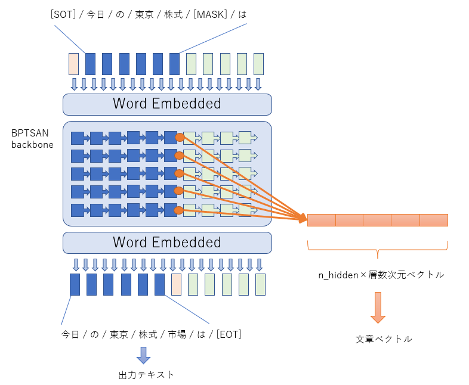

# GPTSAN Model

# モデルの種類

GPTSANでは、異なる4種類の事前学習をサポートします。


Language ModelはGPTと同じで、Transformerは情報を後ろのみへと伝播させるDecoderモデルに、一つ前にずれたトークン列を学習させます。

Masked Language ModelはBERTと同じで、Encoderモデルに文章の一部分をマスクした入力を与え、マスク部分のトークンのみを学習させます。

Hybrid Modelは、[T5](https://arxiv.org/abs/1910.10683)の論文で「Prefix LM」と紹介されている、Transformerの前半がEncoder、後半がDecoderとなっているモデルに、マスクと言語モデルの両方を学習させます。Encoder部分の長さは可変で、事前学習の際にはランダムな長さをEncoderの入力とします。

[T5](https://arxiv.org/abs/1910.10683)の論文によると、ObjectiveをLanguage Modelとした時の最も良いモデルはPrefix LMであるとされているため、文章の続きを生成するタスクには、むしろHybrid Modelが望ましいことになります。

[T5](https://arxiv.org/abs/1910.10683)自体は文章要約を目的に学習されているので、「Prefix LM」は採用されませんでしたが、GPTSANでは、T5の論文における、ObjectiveをLanguage Model、ModelをPrefix LMとした組み合わせを、「Hybrid Model」と呼んでいます。

Hybrid Modelの前半部分（全てのトークン間に接続がある部分）では、Masked Language Modelとしての穴埋め問題の学習も行います。

# MLM

[こちら](https://drive.google.com/drive/folders/1ci17cB4StbXTAmiJ2VaN8hHIqU3Aj2Y8)のGoogle Driveフォルダに、パラメーター数2.8Bの学習済みモデルがあります。

上のモデルは、hybrid_rate=0.08で学習した、「Hybrid Model」です。なので、文章生成も、テキストの穴埋め問題も実行することが出来ます。

テキストの穴埋め問題は、「run_languagemodel.py」で実行出来ます。

```sh
$ python run_languagemodel.py --model GPTSAN-2.8B-spout_is_uniform/ --context "武田信玄は、[MASK]時代ファンならぜひ押さえ[MASK]きたい名将の一人。天下統一を目指し勢いに乗る織田[MASK]からも、一目置かれていたと伝わっています。"
{OUTPUT TEXTS}
武田信玄は、戦国時代ファンならぜひ押さえておきたい名将の一人。天下統一を目指し勢いに乗る織田信長からも、一目置かれていたと伝わっています。
```

これにより、BERTと同じような使い方をすることも出来ます。

また、出力文章のスコアや、PredictedトークンIDも表示されます。

# Vectorize

GPTSANのプログラムは、モデル中の任意のトークン位置にある内部ステータスを抽出可能に出来ています。



それには、「run_languagemodel.py」に「--pos_vector」オプションでトークン位置を、「--output」オプションで出力フィアルを指定し、「run_languagemodel.py」を実行します。

```sh
$ python run_languagemodel.py --model GPTSAN-2.8B-spout_is_uniform/ --context "武田信玄は、戦国時代ファンならぜひ押さえておきたい名将の一人。天下統一を目指し勢いに乗る織田 信長からも、一目置かれていたと伝わっています。" --pos_vector 25 --output out.json
$ cat out.json
{"output_text":・・・
"output_vector":[（隠れ層次元数×Transformer層数のベクトル）]・・・
```

「--output」オプションのみ指定し、「--pos_vector」オプションを指定しないと、最後のトークン位置の次のトークン（\<EndOfText\>に対応する位置）の内部ステータスを抽出します。

これにより、文章のベクトル化を高精度に行うことが出来ます。
